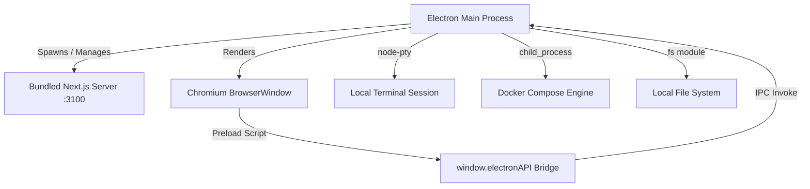

# Desktop App (`apps/desktop`)

Dezign2App provides a native desktop experience powered by **Electron 34**, extending the platform with local compute capabilities, interactive terminal access, Docker container execution, and native file-system persistence.

---

## 🎯 Key Capabilities

- **🖥️ Embedded PTY Terminal**: Native pseudo-terminal emulation (PowerShell on Windows, bash/zsh on macOS/Linux) powered by `node-pty`.
- **🐳 Docker Compose Execution**: Automatically write generated system designs and monorepos to disk and spin them up locally with `docker compose up`.
- **📁 File System Access**: Native folder picker and recursive monorepo file writer via secure Electron IPC handlers.
- **🔌 Typed IPC Bridge**: Type-safe communication channel (`window.electronAPI`) exposing main process capabilities to the React/Next.js frontend.
- **⚡ Self-Contained Runtime**: Bundles an embedded Next.js production server running on port `3100` alongside Electron without requiring a standalone Node.js installation on client machines.

---

## 🏗️ Architecture



### Main Process (`apps/desktop/electron/main.ts`)
- Manages the native application lifecycle (`app.whenReady()`, window resizing, multi-instance prevention).
- Initializes and manages the child Next.js web server process.
- Registers IPC handlers for `fs`, `docker`, and `terminal` subsystems.

### Preload Bridge (`apps/desktop/electron/preload.ts`)
Exposes safe, context-isolated APIs to the renderer via `contextBridge.exposeInMainWorld("electronAPI", ...)`:

```typescript
export interface IElectronAPI {
  fs: {
    pickDirectory: () => Promise<string | null>;
    writeProject: (outputDir: string, files: Array<{ filename: string; content: string }>) => Promise<{ success: boolean; path: string }>;
  };
  docker: {
    up: (projectPath: string) => Promise<{ success: boolean; processId?: number; error?: string }>;
    down: (projectPath: string) => Promise<{ success: boolean; error?: string }>;
    onLog: (callback: (data: { processId: number; text: string; stream: "stdout" | "stderr" }) => void) => () => void;
  };
  terminal: {
    create: (options?: { cwd?: string; shell?: string; cols?: number; rows?: number }) => Promise<{ ptyId: string }>;
    write: (ptyId: string, data: string) => Promise<void>;
    resize: (ptyId: string, cols: number, rows: number) => Promise<void>;
    kill: (ptyId: string) => Promise<void>;
    onData: (callback: (data: { ptyId: string; data: string }) => void) => () => void;
  };
}
```

---

## 🛠️ Development & Building

### Running in Development

```bash
# Start both Next.js web server and Electron window simultaneously
pnpm desktop:dev
```

### Packaging Executables (`.exe` / `.dmg` / `.AppImage`)

```bash
# Builds Next.js production bundle and packages for all platforms
pnpm build:desktop

# Or package for a specific platform:
pnpm build:desktop:win     # Windows
pnpm build:desktop:mac     # macOS
pnpm build:desktop:linux   # Linux
```

Output directory:
```
apps/desktop/release/
├── win-unpacked/
│   └── Dezign2App.exe   # Portable self-contained Windows executable
├── Dezign2App-Setup-*.exe # Windows NSIS installer
├── Dezign2App-*.dmg       # macOS DMG installer
├── Dezign2App-*.mac.zip   # macOS zip archive
├── Dezign2App-*.AppImage  # Linux AppImage
└── Dezign2App-*.tar.gz    # Linux tarball
```

---

## 🚀 CI / CD GitHub Release Automation

Pushed tags matching `v*.*.*` automatically trigger `.github/workflows/release-desktop.yml`:

```bash
git tag v1.0.0
git push origin v1.0.0
```

GitHub Actions will build matrix jobs in parallel across:
- **Windows**: `Dezign2App-Setup-1.0.0.exe` (NSIS installer)
- **macOS**: `Dezign2App-1.0.0.dmg`
- **Linux**: `Dezign2App-1.0.0.AppImage`
